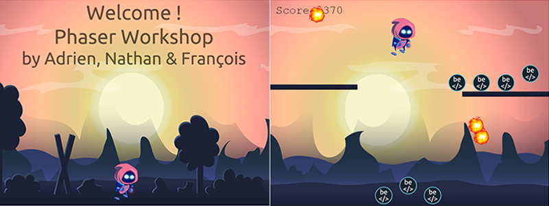

# Phaser Workshop

>
> by [Adrien](https://github.com/osimers1), [Nathan](https://github.com/jacquetnathan) & [François](https://github.com/fwauters)
>

This is the repo of the config for the [Phaser](https://phaser.io/) workshop that we hosted on Friday 20 November 2020 in the context of our formation with [BeCode](https://becode.org/).

## What is it ?

It's a little "collect and score" game, based on [Phaser official tutorial](https://phaser.io/tutorials/making-your-first-phaser-3-game/part1), with two scene and some animations, the idea is to present some of Phaser fonctionnalities and show that it's not so difficult to make a simple but fun game. :wink:



## Get started

1) clone this repo

```git clone https://github.com/fwauters/workshop-phaser```

2) code your game in the game.js file

3) enjoy :grin:

## Got lost ?

The 'steps' folder contains several functional game.js files for each major step :stuck_out_tongue_winking_eye: